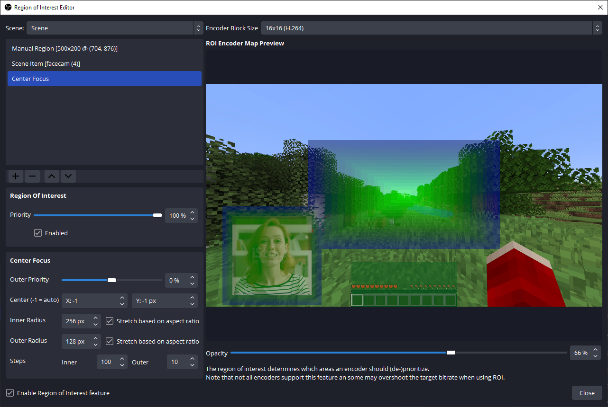
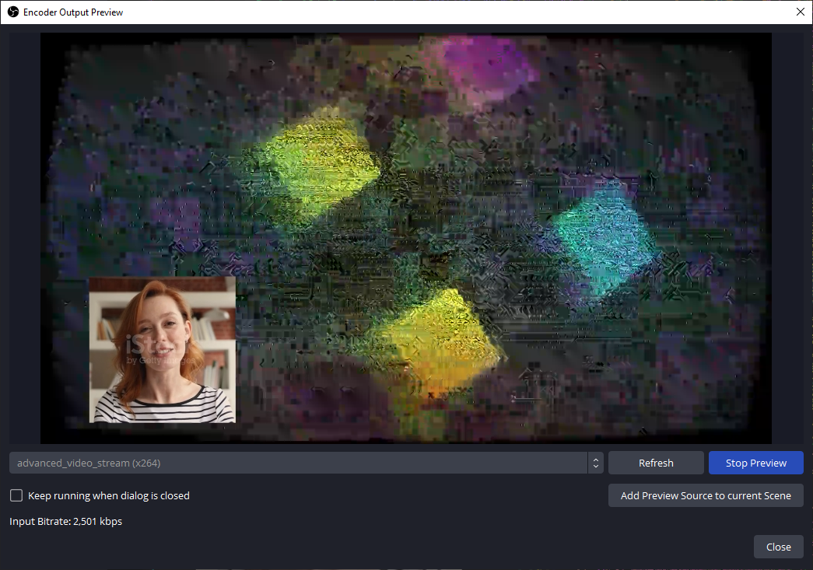

# OBS ROI / Encoder Output Preview

<!-- obs-compatibility-badge:start -->
[](https://github.com/obsproject/obs-studio/releases/tag/32.2.2)
<!-- obs-compatibility-badge:end -->

[](LICENSE)

#### A plugin for encoding nerds.

This plugin adds two features to OBS Studio. Both are available from the
**Tools** menu:

1. Region of Interest Editor
2. Encoder Output Preview

## Region of Interest Editor



The ROI editor lets you assign encoder priority to selected areas of the
canvas. Positive priority favors an area. Negative priority deprioritizes it.

### Features

- Per-scene configuration
- Scene item regions that follow an item
- Manual regions with custom size and position
- Center Focus regions with rectangular or radial shapes
- Smoothing, encoder map preview, and configurable priority

### Encoder support

- NVIDIA NVENC
- AMD AMF
- Intel QSV
- x264

The encoder must advertise OBS ROI support. The priority is guidance to the
encoder, not a strict bitrate allocation.

## Encoder Output Preview



The Encoder Output Preview shows the result of an encoder without starting a
stream or recording. It is useful for checking ROI changes and encoder
settings.

### Features

- Preview recording and streaming encoders while outputs are inactive
- Add the preview as a source for scenes, multiview, and projectors
- H.264, AV1, and HEVC preview support when a decoder is available

## Download

The [Releases](https://github.com/emesinternet/obs-roi-ui/releases) page
contains the Windows x64 installer and ZIP package. GitHub also provides
source code ZIP and tar archives for every tagged release.

<!-- current-release:start -->
The current release is **1.1.2.3322** for OBS Studio 32.2.2. Install the
package while OBS is closed.
<!-- current-release:end -->

## Build

The project uses CMake. On Windows, use the **windows-x64** preset:

```text
cmake --preset windows-x64
cmake --build --preset windows-x64
```

See [the application documentation](docs/application.md) for all settings
and [the update report](docs/update-report.md) for the OBS 32.2.2 changes.

## Compatibility automation

The Codex automation named `OBS ROI weekly compatibility check` checks the OBS
release feed every Sunday at 04:00 UTC. It runs in Codex on the configured
Windows workspace. It builds and runs the plugin with a clean Windows OBS
runtime before it changes the repository.

When the check passes, the task updates the OBS source pin and the badge
above. It does not create a release. When the check fails, it opens an issue.
The Codex task may make only the source and build changes needed for that OBS
version. The same repository build and packaging scripts then create and
verify the installer and ZIP before the task publishes a new release.

The repository scripts create the final files. GitHub Actions only publish
files created by the repository scripts when a release tag is pushed. The
scheduled check and any repair work happen in Codex.

## License

This project is licensed under the GNU General Public License, version 2.
See [LICENSE](LICENSE).
